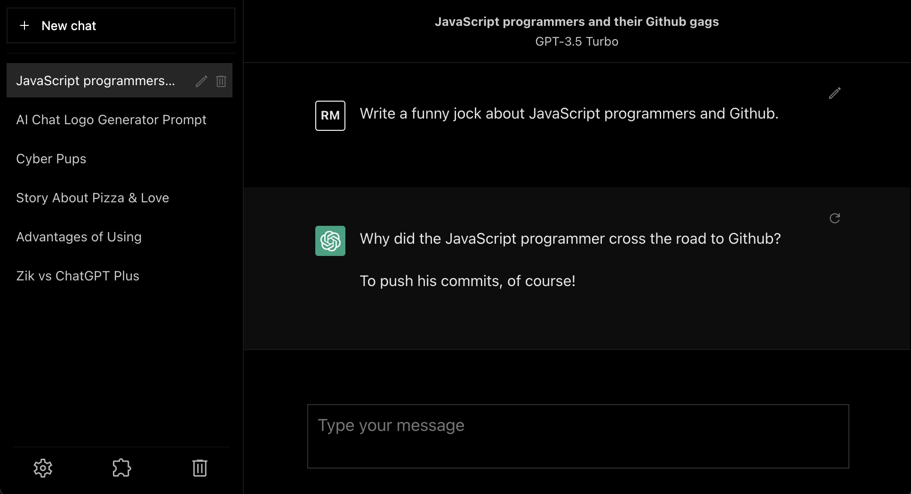
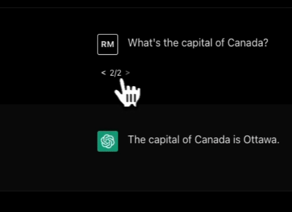
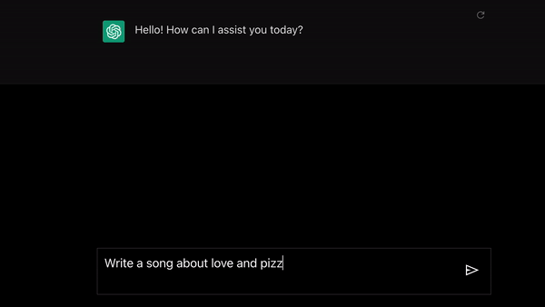
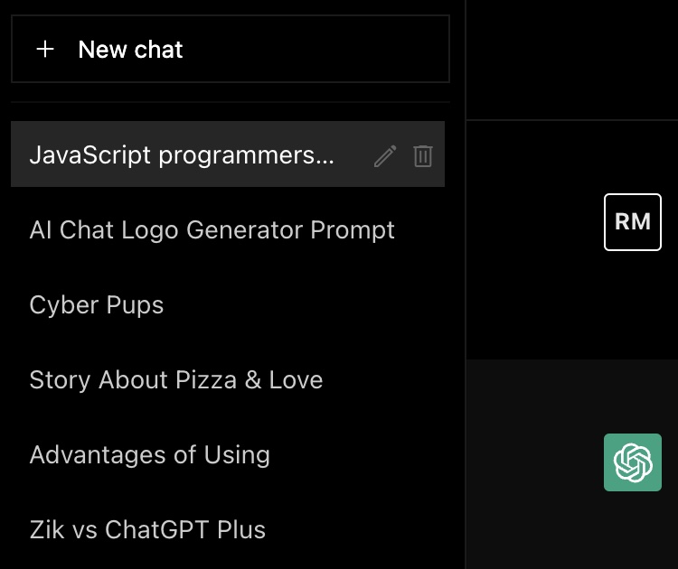
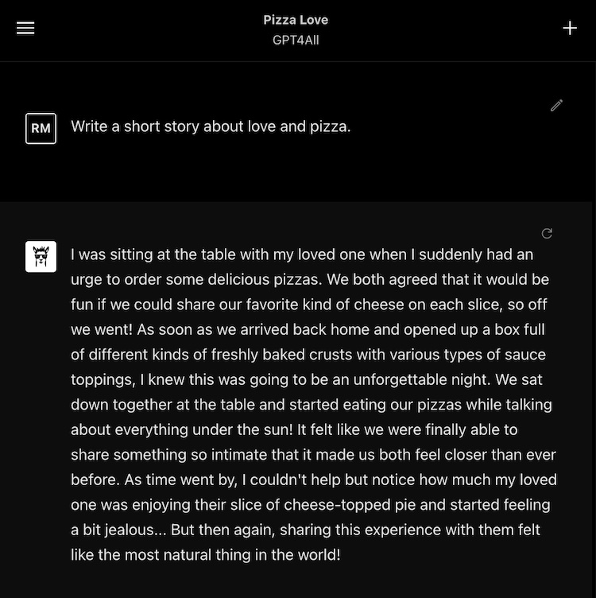
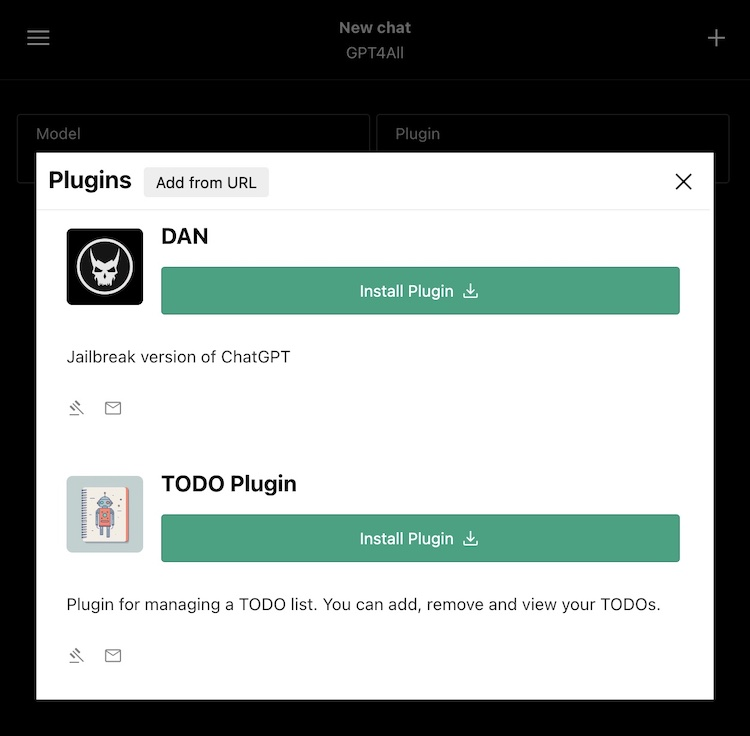

# Zik

Zik is an open-source chatbot user interface similar to ChatGPT, offering
real-time messaging, conversation trees, and plugin support that aligns with
available OpenAI specifications.



## Getting Started with Zik

To begin using Zik, visit the website [zik.sh](https://zik.sh/) and try it out
with OpenAI GPT models (API key required) or GPT4All (local installation
required). Alternatively, you can clone the Zik repository and run it locally
using Docker or NextJS.

### NextJS

1. Clone this repository.
2. After cloning the repository, navigate to the `zik.sh/app` directory and run
   the following commands

```sh
npm install
npm run start
```

### Docker

1. Clone this repository.
2. After cloning the repository, navigate to the `zik.sh` directory and run the
   following command:

```sh
docker-compose up
```

## Why should you use Zik?

1. Flexible pricing: The ChatGPT Plus subscription costs $20 per month, whereas
   Zik allows you to use an API key and pay based on your usage.
2. Unlimited access to GPT-4: ChatGPT Plus restricts users to 25 messages every
   three hours, while Zik permits unlimited messaging with GPT-4 (provided you
   have access to GPT-4 through your API key).
3. Independent plugins system: While plugins for ChatGPT are limited by a
   whitelist, Zik has developed its own plugin system, based on the ChatGPT
   plugins demos and guidelines.
4. Compatibility with other models: Besides GPT-4, Zik also supports GPT4ALL and
   can be used with other models.
5. Zik prioritizes privacy and security by being a frontend-only app that
   connects directly to OpenAI's API from your browser. No third-party servers
   touch your data, and chat history is saved locally with IndexedDB storage.
6. Open-source and extendable: users and developers can easily extend and
   customize the software to suit their specific needs and preferences.

## Features

### Conversation trees



### Real-time messaging with event streams



### Chat history



### GPT4ALL

To use GPT4All, you will need to run the `zik-gpt4all` server locally. You can
learn more about it [here](https://github.com/masasron/zik-gpt4all).



## Plugins



This is still a work in progress, when using plugins, be aware that a lengthy
system prompt may be sent. Please take the time to thoroughly read and
understand the plugin code prior to use.

If you like to try the TODO plugin demo, make sure to run the todo
[server](https://gist.github.com/masasron/6cced78c42b85259143617a87a8de4bf).
